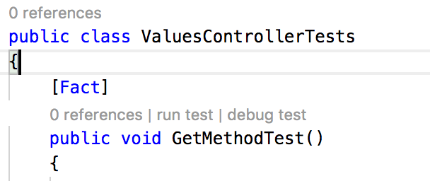

# .NET Core / Web API Tutorial

This part of the tutorial will cover how to set up some simple tests for WebAPI Controllers. We're revisit test writing again [in the next part of the tutorial](../../tree/part-3), which will cover development of a controller to access an existing REST service.

## Part 2: Creating Web API Controller Tests

In the integrated terminal in Visual Studio Code, navigate to the `WebApi.Tests` directory. Create a new unit test project:

```bash
$ dotnet new xunit
```

Change the name of the generated test file to `ValuesControllerTests.cs` to be explicit about the controller that these tests will cover. Add a reference to the project that you are writing controller tests for:

```bash
$ dotnet add reference ../WebApi/WebApi.csproj
```

In the test file, change the name of the newly created class  - a good convention to use is to name your class based on the controller being tested. In this case, we'll use `ValuesControllerTests`. You'll also need to add a `using` statement to reference the assembly containing the controller you want to test. 

Next, add a new method for each controller method you want to test (in this example, we'll only add two tests for the two `Get()` methods we talked about in the last part of this tutorial). Each test method is adorned with a `[Fact]` attribute. 

```csharp
using System;
using Xunit;
using WebApi.Controllers;

namespace WebApi.Tests
{
    public class ValueControllerTests
    {
        [Fact]
        public void GetMethodTest()
        {
            // Assemble
            ValuesController testController = new ValuesController();
            var expected = typeof(string[]);

            // Act
            var actual = testController.Get();

            // Asset
            Assert.IsType(expected, actual);
        }

        [Fact]
        public void GetMethodWithParamTest()
        {
            // Assemble
            ValuesController testController = new ValuesController();

            // Act
            var actual = testController.Get(5);

            // Asset
            Assert.NotNull(actual);
        }
    }
}
```

## Running Tests

You can run these tests using the `dotnet` CLI by doing the following:

```bash
$ dotnet test
```

You can also run tests from within Visual Studio Code - notice that when you view a unit test file, Visual Studio Code provides additional options for running a single test, and for debugging. Clicking on the `run test` option runs a single test in your unit test file.



Using the `debug test` option will run an individual test in debug mode. You can even set breakpoints, and step through your unit test code to ensure that your test is working as anticipated.

Note, this is just a basic overview of testing using [the `xunit` testing framework](https://xunit.github.io/docs/getting-started-dotnet-core).  Writing comprehensive tests is beyond the scope of this tutorial, but we'll explore more concepts related to testing in the [next part](../../tree/part-3).

## Review

In this step, we discussed:

* Writing basic unit tests for Web API controllers.
* Running test using the `dotnet` CLI and from within Visual Studio Code.

In the [next part](../../tree/part-3), we'll cover how to set up tests for Web API controllers.


